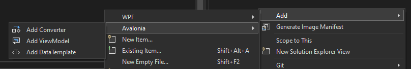

# Avalonia Toolkit

## Features

### Generate Boilderplate Code for Avalonia development

1. Create `ValueConverter`/`MultiValueConverter`
2. Create `ViewModel` in Prism/ReactiveUI flavor
3. Create `IDataTemplate`

## How to Use

Right click on a folder in solution explore

Type in name and click `ADD` button

